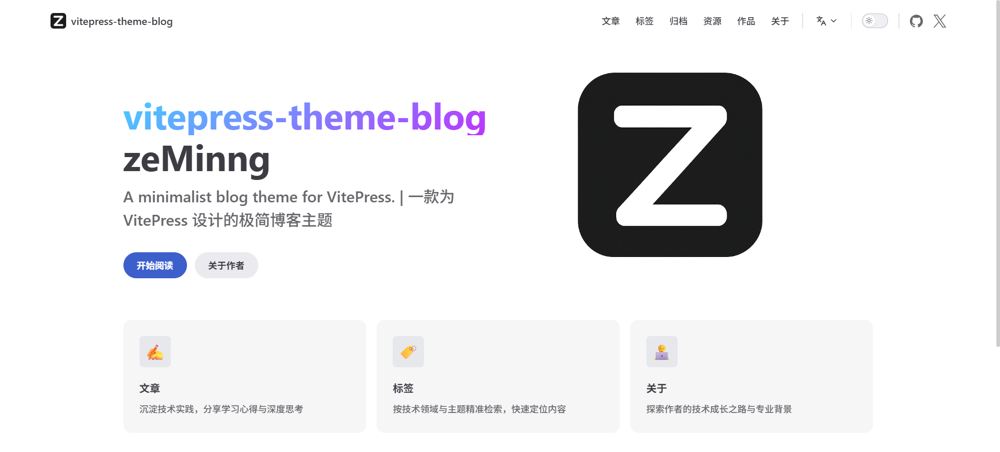
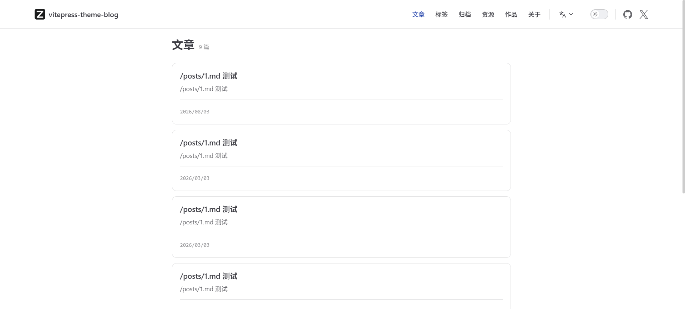
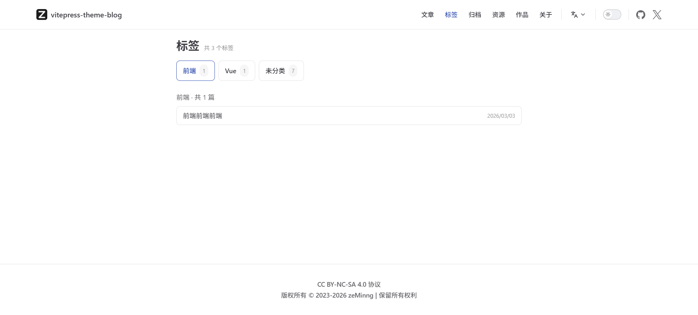
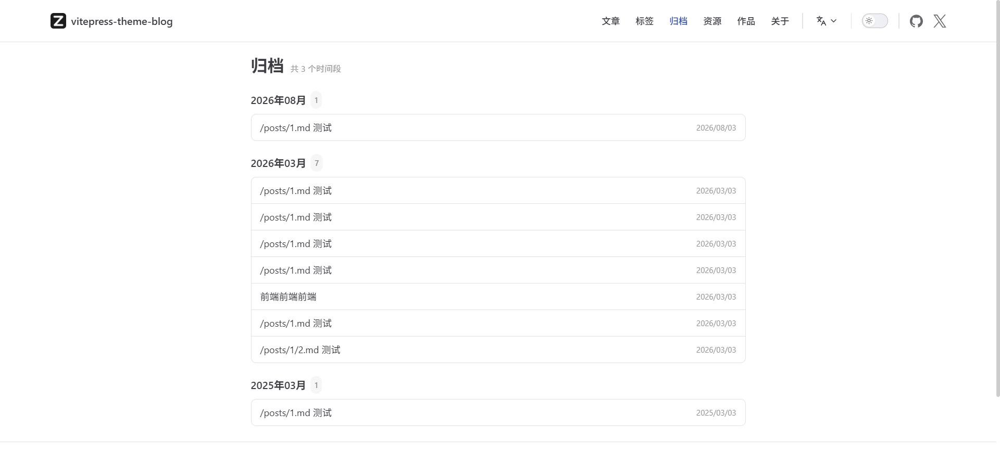
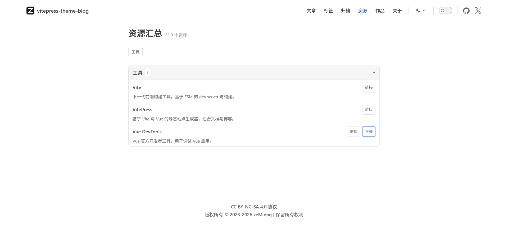
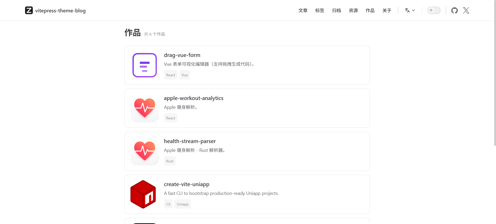

# vitepress-theme-blog

一款基于 VitePress 默认主题扩展的极简博客主题/站点模板，内置：

- **默认 VitePress 首页（layout: home）**，并支持从 `vitepress.config.ts` **动态生成 hero / features**
- **文章列表**：`/postsPage`（分页、摘要、日期、tag 展示）
- **标签页**：`/tagsPage`（按标签聚合文章）
- **归档页**：`/archivesPage`（按年月归档）
- **资源汇总**：`/resourcesPage`（按分类展示链接/下载）
- **作品页**：`/works`

## 效果图

### 首页


### 文章列表页


### 标签页


### 归档页


### 资源汇总页


### 作品页


## 快速开始

推荐使用 npm。pnpm 有不知名的问题

### 安装依赖

```bash
# 安装依赖
npm install
# 本地开发
npm run dev
# 构建与预览
npm run build
npm run preview
```

## 目录结构（核心）

```text
.
├─ .vitepress/
│  └─ config.mts              # VitePress 配置入口（含 transformPageData）
├─ theme-src/
│  ├─ index.ts                # 主题入口（注册各种组件）
│  ├─ styles/index.scss       # 全局样式覆盖
│  ├─ composables/
│  │  ├─ usePosts.data.ts     # 文章数据源（posts/**/*.md）
│  │  └─ useResources.data.ts # 资源数据源（resources/**/*.md）
│  └─ components/
│     ├─ PostList/            # 文章列表组件（含分页）
│     ├─ TagList/             # 标签页组件
│     ├─ ArchiveList/         # 归档页组件
│     └─ ResourceList/        # 资源汇总组件
├─ posts/                     # 文章目录（每篇文章一个 md）
├─ resources/                 # 资源目录（每条资源一个 md）
├─ postsPage.md               # 文章列表页入口（<PostList />）
├─ tagsPage.md                # 标签页入口（<TagList />）
├─ archivesPage.md            # 归档页入口（<ArchiveList />）
├─ resourcesPage.md           # 资源页入口（<ResourceList />）
├─ works/                     # 作品页
└─ vitepress.config.ts        # 站点元信息 + themeConfig/nav + homeConfig
```

## 首页：使用默认 VitePress，但内容动态生成

`index.md` 仅需：

```md
---
layout: home
title: 首页
---
```

然后在 `.vitepress/config.mts` 里通过 `transformPageData` 将 `vitepress.config.ts` 的 `homeConfig` 注入为默认首页所需的 `hero` / `features`（SEO 友好，构建时生成）。

## 写文章（/posts）

把文章放在 `posts/` 下，例如 `posts/hello.md`：

```md
---
title: "文章标题"
date: "2026-03-03"
description: "一句话摘要"
tags: ["前端", "Vue"]
---

正文...
```

说明：

- **title**：文章标题（列表页必备）
- **date**：用于列表排序、归档分组
- **description**：列表页摘要（也可替换成自动 excerpt）
- **tags / tag**：标签页聚合与列表页右侧 tag 展示（支持 `tags: []` 或 `tag: ""`）

## 资源汇总（/resources）

在 `resources/` 下新增资源条目，例如 `resources/vue-devtools.md`：

```md
---
title: Vue DevTools
description: Vue 官方开发者工具，用于调试 Vue 应用。
link: https://devtools.vuejs.org/
download: https://github.com/vuejs/devtools/releases
category: 工具
---
```

- **link**：介绍/官网链接（可选）
- **download**：下载地址（可选）
- **category**：分类（用于分组展示）

## License

本项目使用 `CC BY-NC-SA 4.0` 协议。